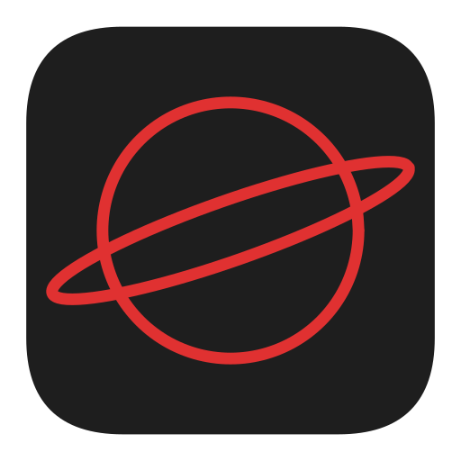

<div align="center">
  
  <h1>orb</h1>
  <p>Resolve, render, and inspect operator bundles and catalogs, all client-side.</p>
</div>

## Usage

### Quick start: from catalog to cluster

```sh
# 1. Add a catalog
orb catalog add operatorhubio docker://quay.io/operatorhubio/catalog:latest

# 2. Resolve the latest bundle for a package
orb catalog resolve vault

# 3. Convert and apply in one shot
orb bundle convert plain \
  "$(orb catalog resolve vault -o jsonpath='{.items[0].image}')" \
  -n operators | kubectl apply -f -
```

### Catalog management

Add catalogs from OCI images, then resolve bundles from them.

```sh
# Add a catalog with labels and priority
orb catalog add operatorhubio docker://quay.io/operatorhubio/catalog:latest \
  --label env=prod --label tier=community --priority 100

# List configured catalogs (sorted by priority)
orb catalog list

# Edit labels and priority
orb catalog edit operatorhubio --label env=staging
orb catalog edit operatorhubio --remove-label tier --priority 50

# Update catalog content (re-pull from registry)
orb catalog update operatorhubio

# Remove a catalog
orb catalog remove operatorhubio
```

### Catalog discovery

Search for packages, view package details, and resolve specific bundle versions.

```sh
# Search for packages by keyword (matches name, description, and keywords)
orb catalog search vault
orb catalog search security

# Show detailed info for a package
orb catalog info vault

# Resolve matching bundles (all versions, sorted by version descending)
orb catalog resolve vault

# Filter by channel
orb catalog resolve vault --channel stable

# Filter by version constraint (Masterminds semver syntax)
orb catalog resolve vault --version ">=0.4.0, <1.0.0"

# Filter by catalog labels (Kubernetes label selector syntax)
orb catalog resolve vault -l env=prod,tier=community

# Find upgrade candidates from an installed bundle
orb catalog resolve vault --installed vault-operator.v0.4.10=0.4.10

# Output as JSON, YAML, or extract fields with JSONPath
orb catalog resolve vault -o json
orb catalog resolve vault -o yaml
orb catalog resolve vault -o jsonpath='{.items[0].image}'
```

### Convert to plain manifests

```sh
orb bundle convert plain docker://quay.io/my/bundle:v1 -n operators
orb bundle convert plain docker://quay.io/my/bundle:v1 dir:/tmp/output -n operators
orb bundle convert plain docker://quay.io/my/bundle:v1 -n operators --cert-provider cert-manager
```

### Convert to Helm chart

```sh
orb bundle convert helm docker://quay.io/my/bundle:v1 dir:/tmp/chart
orb bundle convert helm docker://quay.io/my/bundle:v1 chart-archive:/tmp/chart.tgz
```

The generated Helm chart supports install-time configuration via values:

| Value | Description | Default |
|-------|-------------|---------|
| `watchNamespace` | Namespace to watch. `""` = AllNamespaces; set to a namespace for OwnNamespace/SingleNamespace. | `""` |
| `certProvider` | Certificate provider for webhooks: `"cert-manager"` or `"service-ca"`. Required when the bundle has webhooks. | `"cert-manager"` |
| `deploymentConfig` | Deployment overrides following OLM `subscription.spec.config` semantics. | `{}` |

#### deploymentConfig fields

| Field | Merge behavior |
|-------|---------------|
| `env` | Override by name, append new |
| `envFrom` | Append |
| `volumes` | Append |
| `volumeMounts` | Append to all containers |
| `tolerations` | Append |
| `resources` | Replace |
| `nodeSelector` | Replace |
| `affinity` | Override non-nil sub-fields (nodeAffinity, podAffinity, podAntiAffinity) |
| `annotations` | Existing annotations take precedence |

#### Examples

```sh
# Render with default values (AllNamespaces mode)
helm template my-release /tmp/chart --namespace operators

# Watch a single namespace
helm template my-release /tmp/chart --namespace operators --set watchNamespace=monitoring

# Use service-ca instead of cert-manager for webhook certificates
helm template my-release /tmp/chart --namespace operators --set certProvider=service-ca

# Override deployment resources
helm template my-release /tmp/chart --namespace operators \
  --set deploymentConfig.resources.limits.cpu=2 \
  --set deploymentConfig.resources.limits.memory=8Gi
```

### Helm plugins

`orb` ships with built-in Helm plugins that integrate with the Helm CLI. Use
`orb helm-plugin install` and `orb helm-plugin uninstall` to manage them.

```sh
# Install a plugin
orb helm-plugin install orb-getter

# Uninstall a plugin
orb helm-plugin uninstall orb-getter
```

#### orb-getter

The `orb-getter` plugin registers a Helm getter for the `orb://` protocol,
enabling `helm install`, `helm upgrade`, and `helm template` to resolve and
fetch charts directly from orb-managed catalogs.

```sh
# Install the plugin
orb helm-plugin install orb-getter

# Use it via Helm
helm install my-release "orb://vault/"
helm install my-release "orb://vault/?version=^1.0"
helm install my-release "orb://vault/?channel=stable"
helm upgrade my-release "orb://vault/?version=^1.0"

# Or invoke it directly for debugging
orb helm-plugin run orb-getter "orb://vault/"
```

The `orb://` URL format is `orb://<packageName>/[?<query-parameters>]`. Supported
query parameters:

| Parameter | Description |
|-----------|-------------|
| `version` | Semver version constraint (e.g. `^1.0`, `>=0.4.0, <1.0.0`) |
| `channel` | Channel name filter (repeatable) |
| `catalog-label-selector` | Kubernetes label selector to filter catalogs |
| `release` | Release name for disambiguation when multiple releases share a package name |

When a matching release is already installed in the cluster, the plugin detects
it via the Helm SDK and uses it as an upgrade constraint so that only valid
upgrade candidates are resolved.

### Supported transports

Sources and destinations use skopeo-style transport prefixes.

#### Source (registry+v1 bundle)

| Transport | Description |
|-----------|-------------|
| `docker://` | Container registry |
| `oci:` | OCI image layout directory |
| `oci-archive:` | OCI image layout archive |
| `dir:` | Local directory |
| `tar:` | Tar archive (compressed or uncompressed) |

#### Destination: plain

| Transport | Description |
|-----------|-------------|
| `dir:` | Local directory |
| `stdout` | Standard output (default) |

#### Destination: helm

| Transport | Description |
|-----------|-------------|
| `dir:` | Local directory (chart as files) |
| `chart-archive:` | Helm chart archive (`.tgz`) |

## License

[Apache License 2.0](LICENSE)
